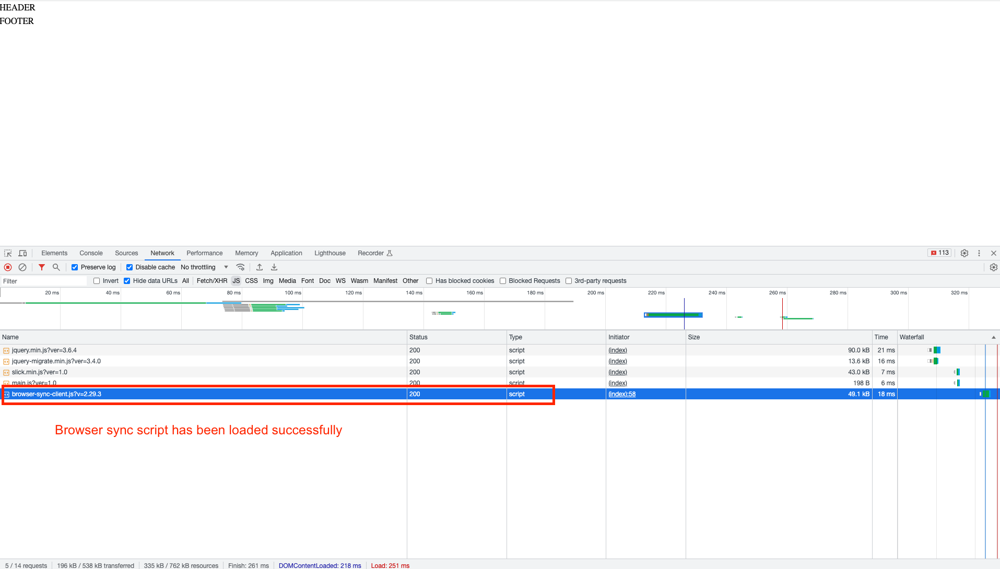
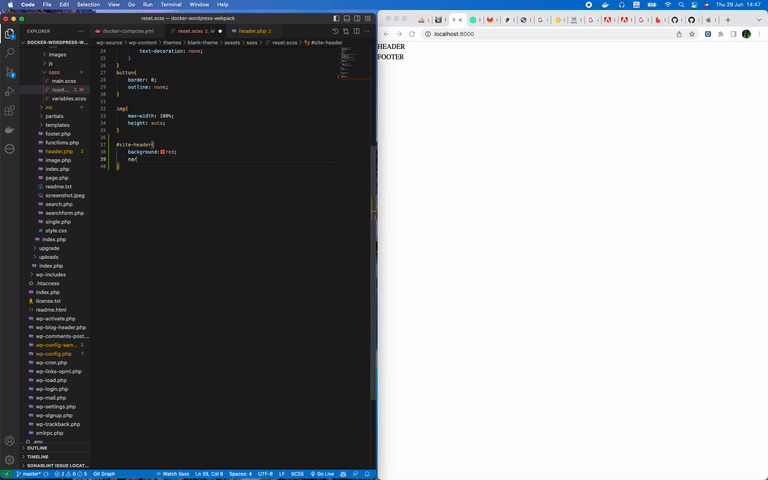

# Intro
A blank WordPress theme integrated with the following features:

- Docker environment
- Webpack for converting Sass to CSS
- BrowserSync to automatically reload the browser whenever you save your code

# Steps to start the project
- Step 1, start docker: `docker-compose up`
- Step 2, install node modules: `yarn install` or `npm install`
- Step 3, start the Browser-sync to watch file: `yarn watch` or `npm run watch`
- Step 4, access the url `http://localhost:8000` and see the result

# Exit a project
`Ctrl / Cmd + C`

# Clear project and delete all things such as files, images, database, etc
`docker-compose down`